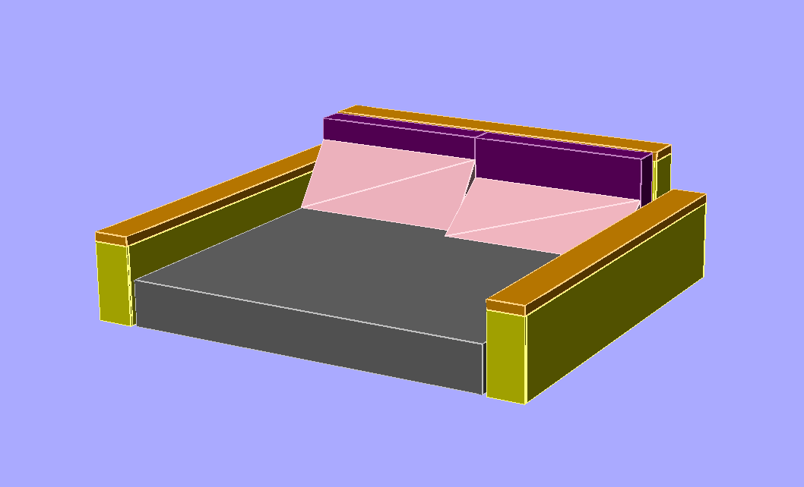

## Couch Design

## BOM

### Ply (0.5" thick)

Side boxes:
2x top ply: 84.5" x 7"
4x side ply: 83.5" x 16.5"
4x end ply: 7" x 16.5"

Back box:
1x top ply: 80" x 7"
2x side ply: 79" x 26.5"
2x end ply: 7" x 26.5"

### Lumber (1.5" x 1.5")

Side boxes:
8x side length lumber: 83.5"
8x end height lumber: 13.5"s
8x end width lumber: 3"

Back box:
4x side length lumber: 79"
4x end height lumber: 23.5"
4x end width lumber: 3"

### Foam

Side boxes:
2x top foam (2" thick): 85.5" x 8"
4x side foam (0.5" thick): 84.5" x 17"
4x end foam (0.5" thick): 8" x 17"

Back box:
1x top foam (2" thick): 81" x 8"
2x side foam (0.5" thick): 80" x 27"
2x end foam (0.5" thick): 8" x 27"

Pillow:
2x pillow foam: 6" x 40" x 19"

Wedge:
2x wedge foam: 10" x 14"

### Fabric

1x mattress fabric: 92" x 184" (maybe more than 92!)
2x side box fabric": 58" x 135.5"
1x back box fabric": 78 x 151"
2x pillow fabric: 62" x 64"
2x wedge fabric: 53.5" x 62"